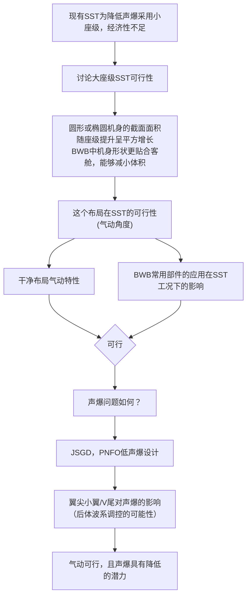

# 160座SBWB低声爆论文 — 叙事框架

## 一、核心故事线

> **"大载客量 SST 能不能低声爆？如果能，路线在哪？如果不能，物理底线在哪？——本文用一次在 160 座约束下的 JSGD 反设计推演，给出了这个行业悬而未决问题的第一个定量探测结果。"**

### 1.1 叙事定位

- **不是**一篇汇报工作的总结报告
- **是**一篇回答行业问题的探索记录
- 每一段话都要让读者觉得"对，你必须说这个，不说这个故事进行不下去"

### 1.2 关键心态转换

99 PLdB 不是"失败的结果"，而是"被首次界定的物理边界"。其意义不在数值大小，而在它的存在本身：**它精确标示了 160 座级低声爆 BWB 在当前外形范式下的物理底线。**

---

## 二、Introduction：三段递进式推理链

### 第一幕：确立"真问题"——大载客量与低声爆的物理矛盾

**开篇钩子**：
"SST 的商业化面对一个根本性两难：要赚钱，需要 ≥150 座；要合法（陆上飞行），需要低声爆。而低声爆要求的细长体积分布与大面积客舱，在面积律（area rule）层面互斥。这不是工程困难，是物理矛盾。"

**逻辑推进**：

1. **FAA/ICAO 陆上超声速飞行禁令** → 低声爆是硬门槛，不可绕过
2. **X-59 证明低声爆物理上可行（~75 PLdB）** → 但仅 1 座，不涉及载客量问题
3. **超声速客机运营经济学** → 盈亏平衡点 ~150 座（Concorde 商业失败的教训：100 座级无法覆盖运营成本，且 Concorde 从未做过低声爆设计，其 ~105 PLdB 不构成"100 座=105 PLdB"的因果关系）
4. **关键冲突浮现**：
   - 低声爆要求等效截面积分布光滑细长（Seebass-George 理论 → A_e(x) 呈钟形缓慢变化）
   - 大载客量要求客舱段等效截面积不低于 A_min = V_cabin / L_cabin（刚性物理下限）
   - 当 A_min > A_e,target(x_cabin) 时，矛盾在数学上不可消除
   - 现有范式下：要么牺牲座位（失去商业性），要么突破目标声爆水平（失去合法性）

**此时读者自然想问**：真的无解吗？有没有第三条路？

> **技巧**：把"载客量-声爆冲突"变成一个可以在等效截面积曲线上精确展示的物理矛盾，而非泛泛的"很难兼顾"。这样 JSGD 等效截面积对比图就成了故事的"关键证据"，而非"附录数据"。

---

### 第二幕：BWB 是不是破局之路？（提出假设）

**承上**：
"BWB 提供了一个潜在出路：
- 升力体机身 → 部分升力由机身产生 → 可减小单独的机翼面积 → 减小浸润面积
- 翼身融合 → 等效截面积分布中'机翼截面积的突然加入'变得平滑 → 客舱膨胀段可以更平缓过渡
- 简言之：**BWB 可能让 160 座的'等效截面积包络'比传统筒-翼构型更接近低声爆目标曲线。**"

**但**：
"现有 BWB 超声速研究几乎全部集中在小型/无人构型（<10 米量级）。
大 BWB 能否兑现这种低声爆潜力？——这个问题需要一次认真的推演。

因为理论上存在一种可能：BWB 只是'缓解'了体积-声爆矛盾，但不改变其根本属性。160 座的体积需求仍然会把 PLdB 推上一条不可接受的高线。

**探索这个上限——找到物理的'硬墙'在哪——就是本文要做的事。**"

> **技巧**：提前"剧透"核心发现方向。这篇论文不是在卖成功，而是在**定义边界**。这就消解了"99 PLdB 太低"的问题——因为你本来就不是去拿满分的，你是去探底的。

---

### 第三幕：需要什么工具来探索这个边界？

**逻辑链（每句承接上一句）**：

"要系统探索 160 座 BWB 的低声爆边界，需要三个彼此衔接的要素：

1. **灵活的几何参数化** → 能在 160 座体积约束下生成光滑 BWB 外形
   → CST 方法：少变量 + 高表达力 + 自光滑 → Section 2.1
   
2. **面向体积约束的低声爆设计方法** → 不是自由优化，是在体积底线约束下逼近目标
   → JSGD 逆设计：等效截面积 → 远场声爆信号的反问题 → Section 2.2
   
3. **对 BWB 后体波系的理解** → 初步探索揭示瓶颈不在机头而在后体
   → 翼梢小翼/后体调控机制 → Section 2.3"

**最终归拢到三个贡献**：
- **C1**：首次在 160 座体积硬约束下实施 BWB-JSGD 反设计，定量给出该载客量级的低声爆物理边界
- **C2**：揭示后体（非机头）波系是大 BWB 低声爆设计的支配性瓶颈——等效截面积残差的主要来源
- **C3**：翼梢小翼参数化扫掠的声爆调控规律，量化了后体局部干预手段的有效范围

---

## 三、全文叙事线：侦探故事结构

整篇论文像一部侦探故事——**"追查 160 座 BWB 的声爆底线"**：

| 章节 | 叙事功能 | 核心问题 | 关键图表 |
|------|----------|----------|----------|
| **Introduction** | 立案 | 为什么"大载客量 vs 低声爆"的矛盾值得追问？| 等效截面积-体积约束矛盾示意图（概念图，非数据图） |
| **Section 2: Methodology** | 配备工具 | 我们需要什么武器来探索这个边界？| CST 参数化示意 + JSGD 反设计流程图 |
| **§3.1 Baseline** | 勘察现场 | 初始 160 座 BWB 构型有多"响"？我们从哪出发？| 基准构型 CFD + 等效截面积分布 |
| **§3.2 JSGD 反设计推演** | 第一轮交锋：撞墙 | 尽全力推 JSGD 反设计 → 在 99 PLdB 撞到物理的墙 | **等效截面积：目标 vs 实际对比（全篇核心图）** |
| **§3.3 后体波系分析** | 追查瓶颈 | 为什么撞墙？瓶颈在哪？→ 不在机头，在**后体** | 后体波系结构图（激波/膨胀波/反射耦合） |
| **§3.4 翼梢小翼参数研究** | 局部反击 | 后体能否局部改善？能改善多少？ | 小翼长度/后掠角 vs PLdB 曲线 |
| **Conclusion** | 结案 | 160 座 BWB 的声爆底线约 99 PLdB，三条含义 | — |

---

## 四、关键图的叙事策略

### 图 1：等效截面积对比图（全文最重要的图）

**三条曲线叠在同一张图上**：

| 曲线 | 含义 | 样式 |
|------|------|------|
| 黑色虚线 | JSGD 低声爆目标等效截面积分布 | — |
| 红色实线 | 160 座 BWB 优化后的等效截面积分布 | — |
| 灰色阴影带 | 客舱段 | 标注"体积硬约束区" |

**关键视觉**：红色线在客舱段被"推上去"，无法贴合目标曲线。而这个上推的偏差量正好对应了从目标 PLdB 到 99 PLdB 的差距。

**图注文字要点**：
> "客舱段体积约束导致等效截面积存在不可消除的残差。该残差在远场 Whitham-F 函数积分中贡献了约 xx PLdB 的附加声爆强度。**这不是设计失败——它精确标示了 160 座级低声爆 BWB 在当前外形范式下的物理底线。**"

---

### 图 2（已删除）：原"载客量-声爆边界图"的问题

**原方案**：一张散点图，横轴载客量、纵轴 PLdB，把 X-59、Concorde、本文 SBWB 标在上面并画趋势线。

**为什么这是错的**：

1. **Concorde 未做低声爆设计**——它的 ~105 PLdB 是"不关心声爆"时代的产物，不是 100 座的物理必然。把它跟 X-59（专门低声爆设计）放在同一图上暗示载客量是唯一变量，属于**归因谬误**。
2. **"载客量-声爆关系"本身是未知的**——学界目前只有 X-59 一个验证过的低声爆数据点。画一条趋势线穿过两三个不可比的数据点，是用图表制造"假知识"。
3. **审稿人一眼就能看出这个漏洞**——与其被指出，不如自己不要犯。

### 替代方案：不画跨机型对比图，用物理推导代替

Introduction 中不需要靠其他飞机来论证矛盾的存在。矛盾直接在 Whitham 积分里就能看到：

**概念图替代思路**：画一张示意图，只有两条曲线——

- **黑色虚线**：Seebass-George 低声爆目标等效截面积分布 A_e,target(x)（一条光滑的钟形或多项式曲线）
- **灰色填充区**：160 座客舱体积在等效截面积上划出的**硬下限**——A_e 在这一段不能低于某值，因为座位和过道的物理尺寸是给定的

图的功能不是"展示数据"，而是**展示矛盾在数学上的必然性**：

> "低声爆要求 A_e(x) 遵循目标分布；但载客量要求 A_e(x) 在客舱段不低于 V_cabin/L_cabin。当这个下限高于目标曲线时，矛盾不可消除，只能量化其代价。"

**这个思路的好处**：
- 不依赖任何其他飞机的数据
- 矛盾来自物理约束（座舱尺寸 ÷ 长度）与理论目标（S-G 分布）的比较
- 读者自己就能从图上看出来"这是数学上的无解，不是优化的无能"
- 与 Results 中的等效截面积对比图形成呼应——Introduction 是概念版，Results 是数据版

---

### 图 3：后体波系结构示意

**内容**：BWB 后体区域的激波/膨胀波/反射耦合结构（基于 CFD 结果）  
**功能**：让读者直观理解为什么后体（而非机头）是大 BWB 的声爆瓶颈  
**标注**：机身末端激波、机翼后缘膨胀波、V 型尾翼激波的相互作用区域

---

### 图 4：翼梢小翼参数-声爆响应

**横轴**：小翼长度（或后掠角）  
**纵轴**：PLdB  
**功能**：展示小翼对声爆的调节幅度（如 2-3 PLdB），同时表明其局限性（无法突破体积约束的全局瓶颈）

---

## 五、逻辑衔接修补对照表

Introduction 各段之间必须是"这段讲完，读者自然逼出下一段"的关系，而非拼盘。

| 衔接点 | 当前问题 | 修补后的推理动力 |
|--------|----------|------------------|
| 声爆问题 → 载客量 | "现有构型载客量偏小"（陈述现象，无因果关系） | **"面积律从根本上约束了低声爆体的细长比 → 细长比限制客舱截面积 → 物理上限决定了载客量。这不是设计选择问题，是物理约束问题。"** |
| 载客量 → BWB | "BWB 可提升容积效率"（跳，没解释为何 BWB 是答案） | **"既然传统筒-翼的细长比-容积矛盾在面积律下无解，我们需要一种降低'等效截面积膨胀代价'的布局。BWB 的升力机身等效于把机翼面积'藏'进机身截面，减少了单独的机翼截面积贡献。"** |
| BWB → JSGD | "JSGD 是逆设计方法"（工具介绍和论证脱节） | **"即使 BWB 提供了更好的起点，160 座的体积需求仍然远超任何现有低声爆构型。我们需要一个在约束下高效探索下限的工具——JSGD 逆设计正好以等效截面积为中间变量，天然适合'给定体积约束→求最低声爆外形'的反问题。"** |
| JSGD → 参数化 | "需要参数化方法"（泛泛） | **"但 JSGD 需要高维外形变量驱动。对于 160 座大 BWB，直接的全自由变形（FFD）会产生奇异外形——我们需要一个降维策略。CST 参数化以少量分类函数控制大尺度外形，恰好充当 JSGD 和几何生成之间的'语言翻译层'。"** |
| 参数化 → 后体 | "翼梢小翼影响声爆"（没交代为什么转向后体） | **"初步 JSGD 结果揭示一个现象：即使机头-中段匹配良好，后体区域的残差仍然显著。大 BWB 的后体波系（机身末端激波+机翼膨胀波+平尾反射的耦合）可能是最终瓶颈——这驱动了我们对后体和翼梢小翼的专项分析。"** |

---

## 六、摘要重写

### 原文问题

- "proposed a configuration" → 谁都能提构型，不构成学术贡献
- "a parametric method is developed" → 方法不是贡献，方法**解决的问题**才是
- "effects of winglet length and sweep angle on sonic boom characteristics are investigated" → 这是过程描述，不是发现

### 重写版

> **Why**
> The overland flight ban—rooted in sonic boom—is the single greatest barrier to commercial supersonic transport (SST). While low-boom shaping has been demonstrated at single-seat scale (X-59), commercially viable SSTs must carry 150+ passengers, creating a fundamental conflict: low boom demands slenderness; high capacity demands volume.
>
> **What we did**
> This paper presents the first systematic feasibility analysis of a 160-seat supersonic blended-wing-body (SBWB) configuration under strict cabin volume constraints, using a CST-based parametric geometry model coupled with JSGD inverse design.
>
> **Key findings**
> 1. Under the 160-seat volume constraint, JSGD inverse design achieves a ground boom floor of ~99 PLdB—a reduction of [xx] PLdB from the baseline, and the first quantitative boundary established for this capacity class.
> 2. Equivalent area analysis reveals the residual boom above the Seebass-George target originates predominantly from the midbody cabin-volume constraint and afterbody shock-expansion coupling—not from nose shaping.
> 3. Winglet parametric sweeps show secondary but meaningful boom modulation (~X PLdB), indicating afterbody flow control as a complementary low-boom strategy.
>
> **Conclusion**
> The SBWB configuration demonstrates that passenger capacity and low-boom shaping can be partially reconciled, but a hard physical floor—driven by cabin volume—exists. Identifying this floor, rather than crossing it, is the contribution of this paper.

---

## 七、时间分配建议（假设剩余 2 周）

| 阶段 | 时间 | 任务 | 产出物 |
|------|------|------|--------|
| **1. 定框架** | 前 3 天 | 重写 Introduction 叙事链；确定核心 argument；确认每张关键图的角色 | 定稿的 Introduction + 图清单 |
| **2. 出结果** | 第 4-7 天 | 绘制四张关键图；补充必要的数据后处理（基线 PLdB 估算、等效截面积对比曲线）；写 Results 部分 | 四张关键图 + Results 初稿 |
| **3. 写全文** | 第 8-11 天 | 写 Method + Conclusions；整合全文；检查逻辑链是否自洽 | 全文初稿 |
| **4. 打磨** | 最后 3 天 | 全文通读；检查图表标注；摘要精修；参考文献核对 | 定稿 |

---

## 八、关键原则

> **宁可文章短但有刺，不要面面俱到但平淡。**

国际会议论文的读者记住的是你的**核心 insight**（"160 座 SST 有物理上的声爆下限，这是该载客量级的定量边界"），而不是你用了什么方法。

三个硬性自检标准：

1. **读完 Introduction 后，读者能不假思索地说出本文要回答的那个"行业问题"是什么吗？**
2. **读完 Results，读者能否复述一个简明的论证："160 座客舱的等效截面积下限与 S-G 目标曲线之间存在不可消除的残差 → JSGD 被推到 99 PLdB 为止 → 残差主要来自后体区域 → 这是该载客量级在当前范式下的物理约束表现"？**
3. **结论中是否有可靠的、可被后续研究引用的数字或机制？（99 PLdB 是 160 座 BWB 在 JSGD 反设计下达到的水平；残差的空间分布特征；翼梢小翼的调控幅度。）**

注意：本文的引用价值不在于"我们定义了载客量-声爆关系曲线"（我们没有），而在于"我们对 160 座这个量级进行了第一次认真的推演，给出了一个参考点和方法框架"。

